# trucking-tracker
Trucking Tracker App

The Trucking Tracker App is a comprehensive mobile solution designed to streamline and manage the complex logistics of trucking operations, offering drivers and fleet managers a central hub for essential activities. It appears to feature robust tools for capturing and maintaining detailed electronic logs, managing load status and dispatch information, tracking mileage and fuel consumption, and providing an accessible view of critical documents and reporting metrics. By integrating these functions, the application aims to minimize paperwork, ensure regulatory compliance, and deliver actionable insights, ultimately enhancing operational efficiency and accountability across the entire fleet management workflow.

## 📱 App Screenshots

| | | | |
| :---: | :---: | :---: | :---: |
| **1. Splash Screen** | **2. Login Screen** | **3. Home Screen** | **4. Slide Drawer Screen** |
| 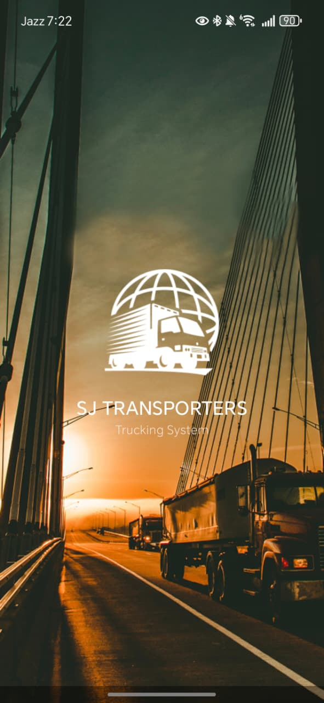 | 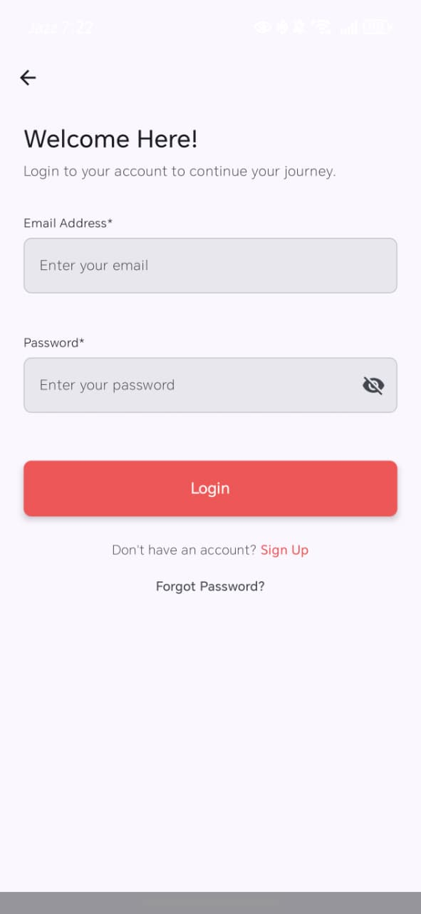 | 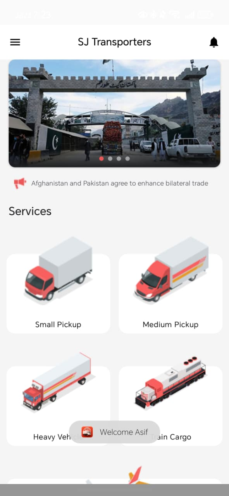 | 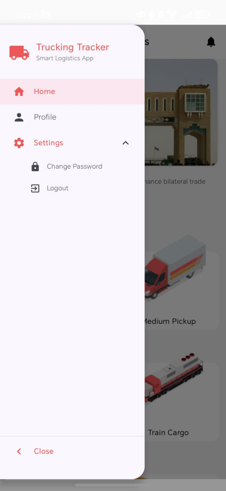 |
| **5. Profile Screen** | **6. Edit Profile Screen** | **7. Change Password Screen** | **8. Logout Dialogue Box** |
| 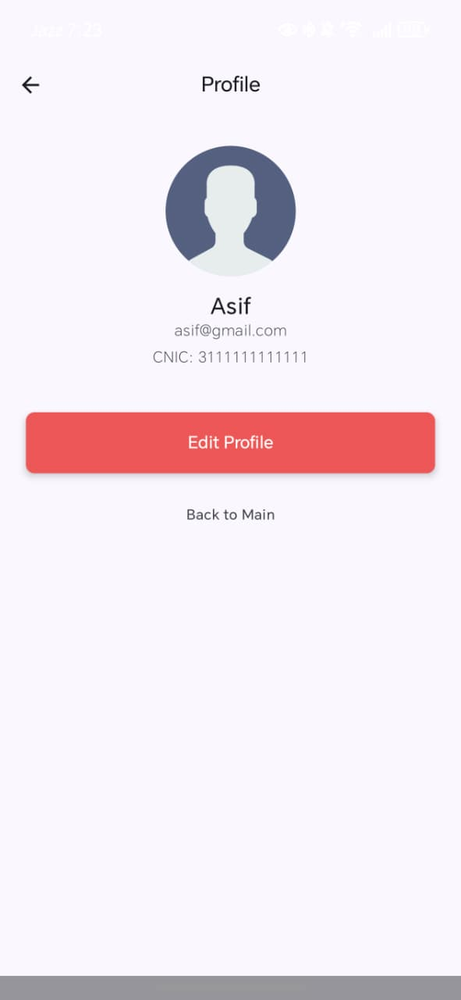 | 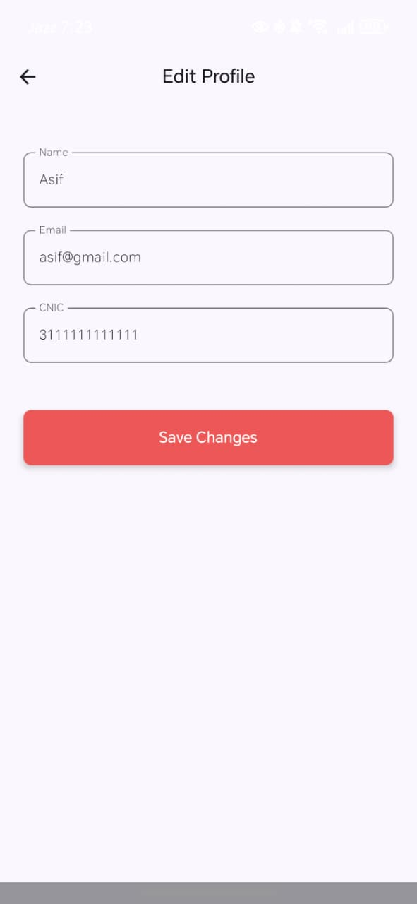 | 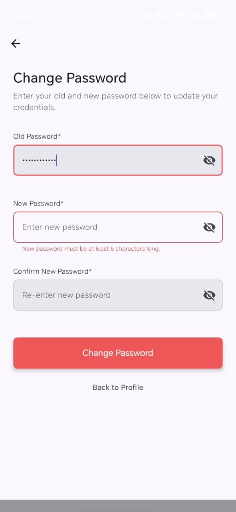 | 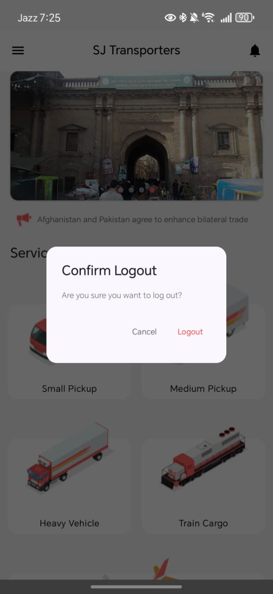 |
| **9. Vehicle Select Bottom Screen** | **10. Route Map Screen** | **11. Booking Details Screen (1)** | **12. Booking Details Screen (2)** |
| 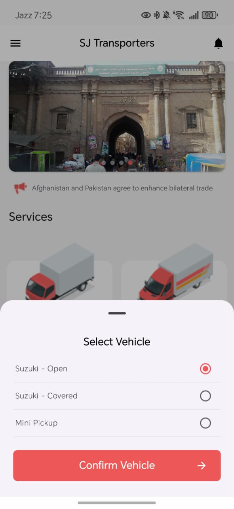 | 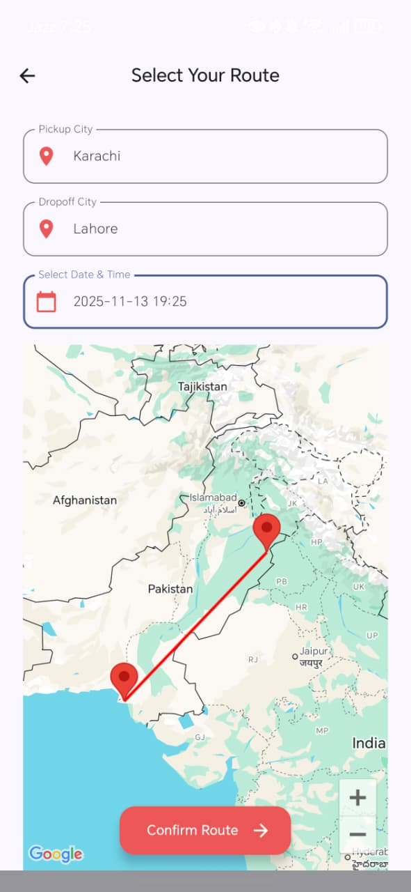 | 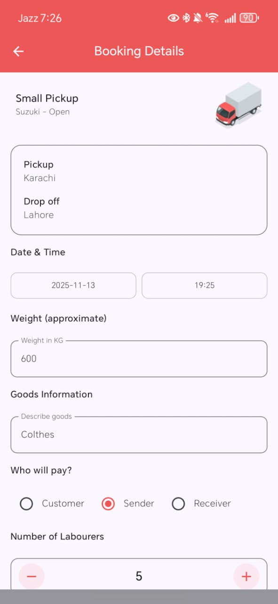 | 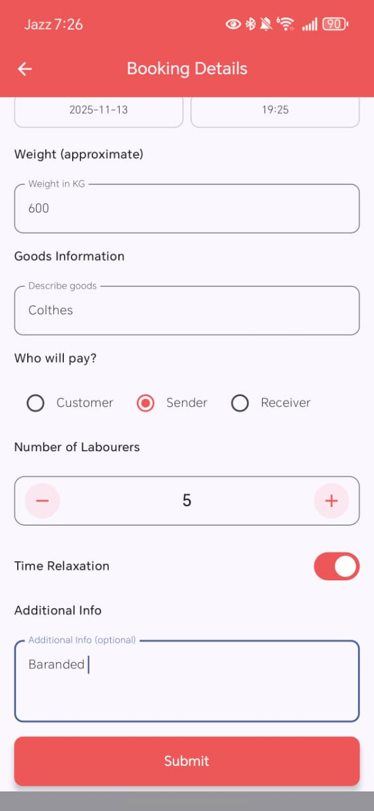 |
| **13. Order Confirmation Screen** | **14. Booking History Screen** | **15. Forgot Password Screen** | **16. Signup Screen (1)** |
| 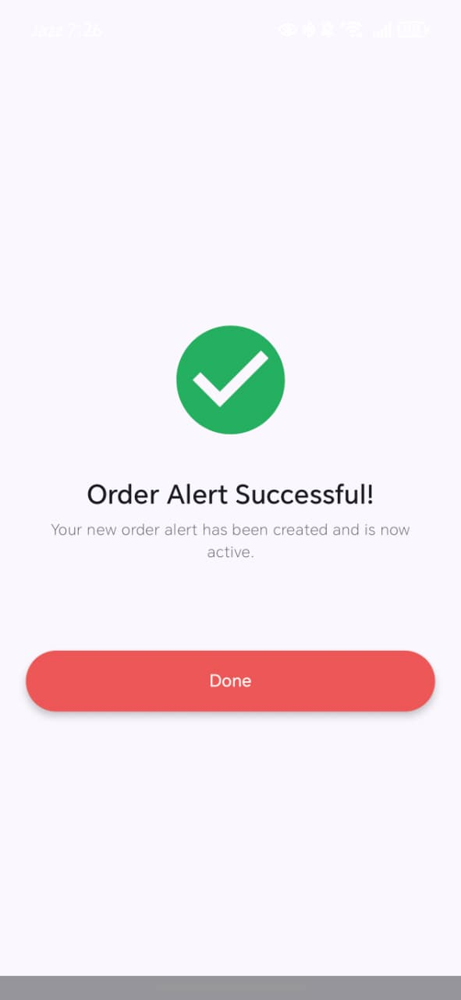 | 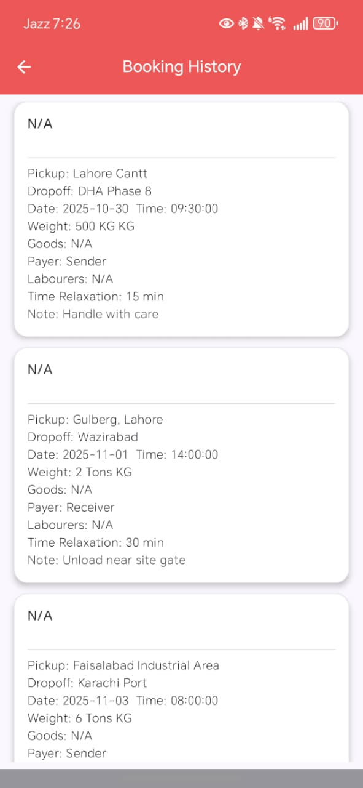 | 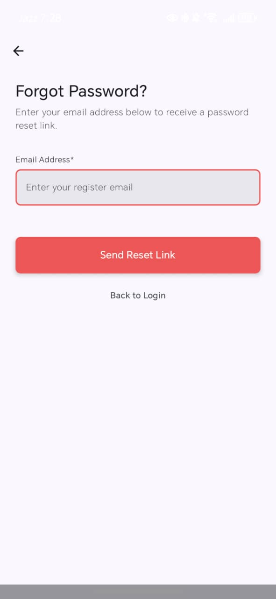 | 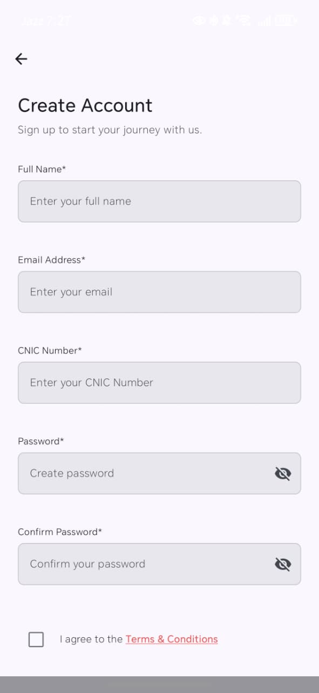 |
| **17. Signup Screen (2)**
| 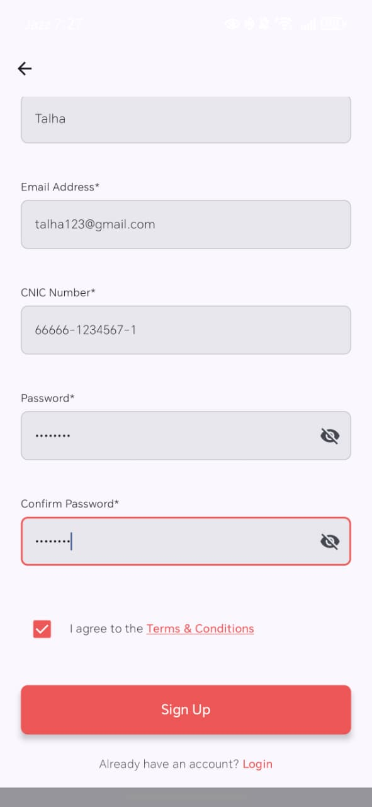
